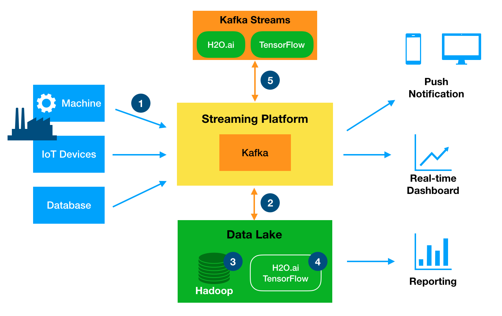

# ML-automation

This presentation describes the high-level architecture of real-time Machine Learning automation.
The system allows:
* collect real-time events from different devices (IoT devices, machines, etc)
* apply previously developed ML models to the data (make predictions)
* react on anomalies or prediction of insufficient behaviour (send notifications or managing commands to machines)
* store incoming data in Data Lake for further analysis or training
* train new ML models or make predictions on off-line data
* analyse data using traditional reporting tools

## 1. Capture real-time events
Kafka becomes the central point on the ML architecture. It can collect events from machines in real-time and store them for further batch offloading, apply ML algorithms to these events and push a result to another systems or applications, streaming data to another systems.

## 2. Batch offloading 
Real-time events are ingested into Data Lake via Kafka Connectors. Ingestion is performed in batch hourly or daily (depending on the requirements).

## 3. Data Lake 
Data Lake is central long term storage of all collected data, either from machines, web application or databases. The data can be used by Data Scientists, Analysts for building reporting, dashboards or train ML models.

## 4. Model training
H2O.ai is used to analyse the collected data in Data Lake to build a ML model using appropriate algorithms (GLM, Random Forest, Neural Network, CNN, etc.). The data scientist can use its preferred interface - R, Python, Scala, Web UI Notebook. The model building and validation runs on the Hadoop cluster processing the data at rest. The result is a trained analytic model generated as Java code by H2O.ai. This is ready for production deployment (see next step).

## 5. Real-time prediction
Collected real-time events can be pushed to ML model, built in the previous step. In case of anomalies or predicting insufficient behaviour, result from the model can be immediately transferred to another system, or the responsible person will be notified.
Real-time model execution is implemented in Kafka Stream, Flink or Spark Streams (depends on the requirements).

